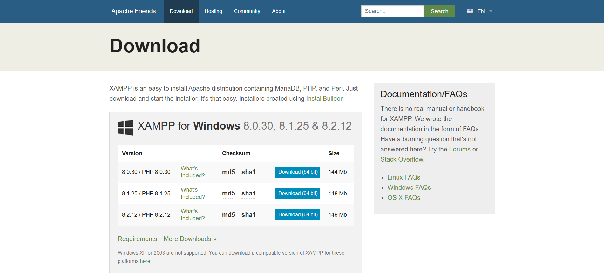
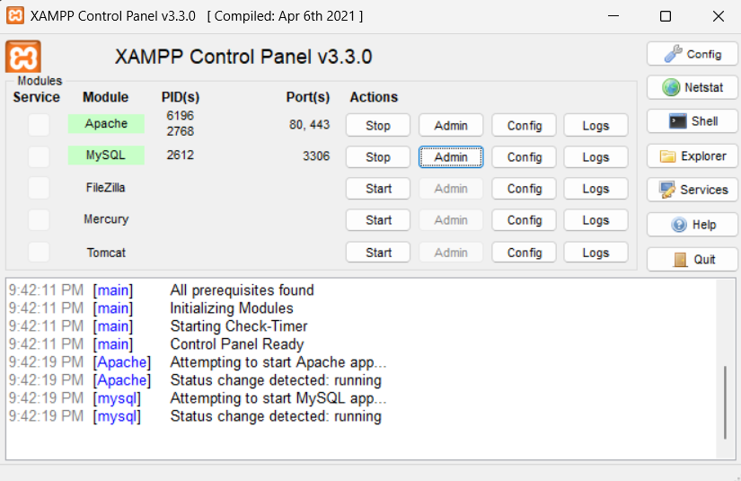

# **☕Magnum_Cafe_Ordering_System_Group1**

Magnum Cafe is an online platform built for the Final Year Project of Software Development Course (DDWD3723) representing group G01_38. It's dedicated to selling a diverse range of ice cream flavors, allowing customers to browse and order their favorite treats conveniently. Integrated with admin and staff dashboard that allows for monitoring of user feedback, item stocks, orders, user/staff credentials and sales report.

# 🛠️Installation

To run this program, you will need to install this thing:

+ XAMPP

# ⚙️Install XAMPP

Download the Windows Installer from [XAMPP Official Website](https://www.apachefriends.org/download.html)

Make sure you downloaded the latest version of XAMPP. It should include the following things:

+ Apache 2.4.58
+ MariaDB 10.4.32
+ PHP 8.2.12
+ phpMyAdmin 5.2.1
+ OpenSSL 3.1.3
+ XAMPP Control Panel 3.2.4
+ Webalizer 2.23-04
+ Mercury Mail Transport System 4.63
+ FileZilla FTP Server 0.9.41
+ Tomcat 8.5.96 (with mod_proxy_ajp as connector)
+ Strawberry Perl 5.32.1.1 Portable

Use this [video](https://www.youtube.com/watch?v=yHkxKyNL2gE) as a guideline on how to install and setup XAMPP wizard. It also shows how to open phpMyAdmin which will be used to store database for the project.

# ⛓️Getting Started
1. Open XAMPP and activate both Apache and MySQL Module simply by pressing the "Start" button 
2. Create a new folder named "MASTER PROJECT - MAGNUM CAFE SYSTEM" in "C:\xampp\htdocs"
3. Clone the Magnum_Cafe_Ordering_System_Group1 inside that folder
4. Download database data from [🔗Useful Links](#usefull-links)
5. Open phpMyAdmin and create a new database named "ecommerce_db"
6. Import the "ecommerce_db.sql" file into the "ecommerce_db" database
7. To run the website, open a new tab and enter the following: "localhost/MASTER PROJECT - MAGNUM CAFE SYSTEM/Magnum_Cafe_Ordering_System_Group1/index.php"
8. As you first enter "index.php", you'll be signed in as a guest. Use the credentials provided in [🔑User Credentials](#user-credentials) to login as admin/staff/user
9. Enjoy

# 🔗Usefull Links

[Link](https://github.com/korangg/Magnum_Cafe_Ordering_System_Group1) of Github for source code

[Link](https://magnumcafe.shop/) of the project

[Link](https://www.mediafire.com/file/h2acvrxv8d38gah/ecommerce_db.sql/file) to download localhost database from MediaFire

# 🔑User Credentials

**Admin**

- Username: admin1  
  Password: Test123

&nbsp;
**Staff**

- Username: staff1  
  Password: Test123

- Username: staff2  
  Password: Test123

- Username: staff3  
  Password: Test123

&nbsp;
**User**

- Username: izudin  
  Password: Test123

- Username: farysh  
  Password: Test123

# 💡Authors

+ @korangg
+ @Peashy77
+ @syahmihariz11
